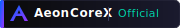
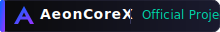
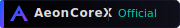

<div align="center">

  

  <h1>AeonCoreX™ Lab</h1>
  <p><strong>Next-Generation Technology Solutions</strong></p>

</div>

---

## 🚀 About AeonCoreX™

**AeonCoreX™** is a forward-thinking technology organization dedicated to building cutting-edge solutions in streaming, blockchain, AI, and digital transformation. Founded with a vision to revolutionize how users interact with digital content, AeonCoreX™ combines innovation with reliability.

### 🏢 Company Information

| Detail | Information |
|--------|-------------|
| **Company Name** | AeonCoreX Blockchain Private Limited |
| **Founded** | August 20, 2025 |
| **Status** | Active |
| **Type** | Private Limited Company |
| **Industry** | Blockchain, Streaming, AI, Software Development |
| **Headquarters** | Bangladesh |

### 🎯 Our Mission

> *"Building the future of digital experiences through innovative technology solutions that empower users and transform industries."*

### 💡 What We Do

- 📺 **Live TV & Streaming Platforms** — Next-gen entertainment solutions
- ⛓️ **Blockchain Solutions** — Decentralized applications and services
- 🤖 **AI & Machine Learning** — Smart automation and intelligent systems
- 📱 **Mobile Applications** — Cross-platform native experiences
- ☁️ **Cloud & DevOps** — Scalable infrastructure solutions

---

## 🛡️ Official Badge Collection

Use these badges in any AeonCoreX™ repository to show official project status.

### Badge Variants

| Badge | File | Size | Best For |
|-------|------|------|----------|
|  | `aeoncorex-badge.svg` | 180×28 | **Standard** — Main headers |
|  | `aeoncorex-badge-mini.svg` | 120×20 | **Compact** — Inline badges |
|  | `aeoncorex-badge-wide.svg` | 220×32 | **Featured** — Special projects |
|  | `aeoncorex-badge-dark.svg` | 180×28 | **Dark** — Dark themes |
|  | `aeoncorex-badge-light.svg` | 180×28 | **Light** — Light themes |
|  | `aeoncorex-badge-shield.svg` | 200×32 | **Shield** — Premium projects |

---

## 📦 Usage Guide

### Quick Start — Any Repository

Add this to your `README.md`:

```markdown
<a href="https://github.com/AeonCoreX-Lab">
  
</a>
```

### Compact Version

```markdown
<a href="https://github.com/AeonCoreX-Lab">
  
</a>
```

### With Other Badges

```markdown
<p align="center">
  <a href="https://github.com/AeonCoreX-Lab">
    
  </a>
  
  
</p>
```

---

## 🎨 Design Specifications

| Element | Value |
|---------|-------|
| **Primary Colors** | Blue `#0066FF` → Purple `#9933FF` |
| **Accent Color** | Teal `#00D4AA` |
| **Background** | Dark `#0A0A0A` → `#1a1a2e` |
| **Font** | Segoe UI, system fonts |
| **Style** | Modern, minimal, premium |

---

## 🌐 Connect With Us

- 🐙 **GitHub:** [github.com/AeonCoreX-Lab](https://github.com/AeonCoreX-Lab)
- 🤗 **Hugging Face:** [huggingface.co/AeonCoreX-Lab](https://huggingface.co/AeonCoreX-Lab)
- 🌐 **Website:** Coming Soon
- 📧 **Email:** contact@aeoncorex.com

---

## 📄 License

© 2025 AeonCoreX™ Blockchain Private Limited. All rights reserved.

The AeonCoreX™ name, logo, and badges are trademarks of AeonCoreX Blockchain Private Limited.

---

<div align="center">
  <p><sub>Built with ❤️ by the AeonCoreX™ Team</sub></p>
</div>
